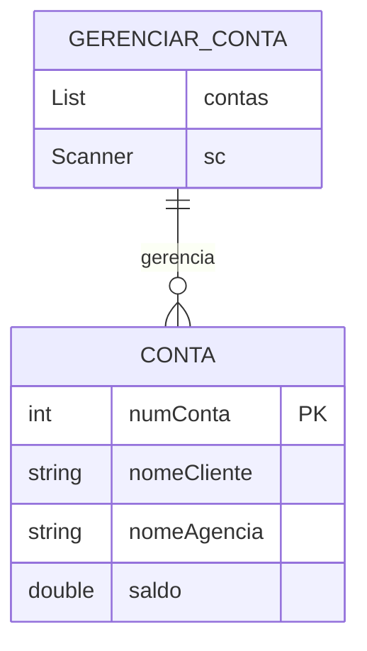
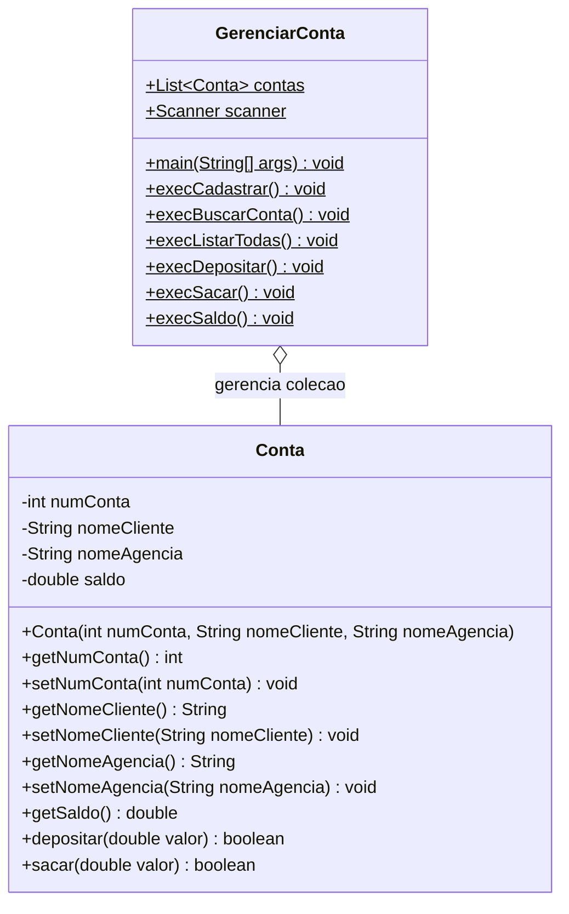

# Roteiro de Prática de Laboratório: Sistema de Gerenciamento Bancário

## 1. Visão Geral e Diagramas da Aplicação

### Diagrama de Relacionamento (Mermaid)

### Diagrama de Classes (Mermaid)

---

1. **Modelagem e Encapsulamento da Entidade Conta:** Criação da classe de modelo.
Instrua os alunos a criarem a classe `Conta` com foco em regras de proteção de dados:

* **Definição de Visibilidade:** Declarar os quatro atributos (`numConta`, `nomeCliente`, `nomeAgencia`, `saldo`) como estritamente privados (`private`).
* **Construção do Objeto:** Criar um construtor que receba apenas o número da conta, nome do cliente e agência. O saldo inicial deve ser atribuído internamente com valor zero (`0.0`).
* **Acessores e Modificadores:** Criar métodos `get` e `set` para `numConta`, `nomeCliente` e `nomeAgencia`. Disponibilizar apenas o `getSaldo()`, omitindo propositalmente o `setSaldo()` para impedir alterações diretas sem validação.
* **Lógica de Transação:**
* No método `depositar`, validar se o valor informado é estritamente positivo antes de somar ao saldo.
* No método `sacar`, validar se o valor é positivo e se a conta possui saldo suficiente para a operação antes de subtrair.

2. **Estrutura Base da Classe GerenciarConta:** Declaração de recursos compartilhados.
Configurar a classe executável `GerenciarConta`:

* **Coleção em Memória:** Declarar a lista de contas (`List<Conta>`) instanciando um `ArrayList<Conta>` no escopo da classe para ser acessível pelos métodos auxiliares.
* **Entrada de Dados:** Instanciar o objeto `Scanner` associado ao fluxo padrão de entrada (`System.in`).

3. **Loop de Execução e Menu Interativo:** Fluxo de controle com Switch aprimorado.
Implementar o método `main()`:

* **Estrutura de Repetição:** Utilizar um laço `while` que mantém o programa em execução contínua até que a opção de saída seja acionada.
* **Apresentação Visual:** Exibir as opções numéricas correspondentes a cada ação (Cadastrar, Consultar Conta, Listar Todas, Depositar, Sacar, Consultar Saldo e Sair).
* **Desvio Condicional:** Utilizar a sintaxe do **Enhanced Switch** (Switch com flechas `->`) para direcionar a execução diretamente à chamada de cada método auxiliar sem a necessidade de cláusulas `break`.

4. **Implementação das Rotinas de Leitura e Cadastro:** Métodos execCadastrar e execListarTodas.
Construir os métodos de manipulação da coleção:

* **execCadastrar:** Solicitar os dados via teclado, instanciar um novo objeto `Conta` com os valores recebidos e inseri-lo na lista dinâmica.
* **execListarTodas:** Percorrer a lista de contas exibindo os dados cadastrais e saldos de cada registro existente, tratando mensagens amigáveis caso a lista esteja vazia.

5. **Implementação das Operações de Consulta e Financeiras:** Métodos de busca e transações.
Finalizar com as funções operacionais:

* **execBuscarConta:** Solicitar o número da conta, percorrer a lista para localizar o registro correspondente e exibir seus detalhes completos (ou alertar caso não exista).
* **execSaldo:** Localizar a conta pelo número informado e exibir especificamente o valor retornado por `getSaldo()`.
* **execDepositar:** Localizar a conta de destino, capturar o valor desejado, invocar o método `depositar()` do objeto e apresentar feedback de sucesso ou erro com base no retorno booleano.
* **execSacar:** Localizar a conta de origem, capturar o valor solicitado, invocar o método `sacar()` e validar se a transação foi aprovada (saldo suficiente) ou recusada.

---